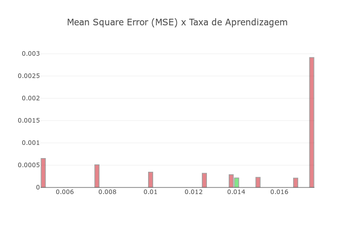

# Backpropagation em Python

- O algoritmo do Backpropagation está implementado na linguagem Python 2.7 no arquivo `backpropagation.py`.

- O algoritmo foi desenvolvido para a aproximação de funções. Foram implementadas três métodos com três funções distintas: `load_first_function`, `load_second_function` e `load_third_function`.

- O arquivo `plot-results.py` foi utilizado apenas para plotar os resultados que serão apresentados a seguir.

## Variação de Nh

Nh | MSE Final
:---: | :------:
1   | 0.114229517678
2   | 0.00322535095676
3   | 0.000758804236756
4   | 0.000479361961268
5   | 0.000342801720977
6   | 0.000428509742598
7   | 0.000616666676686
8   | 0.00053375090329

Na Figura abaixo temos o MSE em função do `Nh` (variando entre 2 e 8). Pelo gráfico fica nítido que, para essa função, o menor erro é obtido no caso em que `Nh = 5`.

## Variação da Taxa de Aprendizagem (TA)

- A taxa de aprendizagem corresponde à variável `eta` do método `__init__` no código do arquivo `backpropagation.py`.

TA | MSE Final
:---:  | :------:
0.005  | 0.000651237838196
0.0075 | 0.000509132366308
0.01   | 0.000342801720977
0.0125 | 0.000318285911086
0.01375| 0.000285617184203
0.014  | 0.000214122650244
0.015  | 0.000226176626778*
0.01675| 0.000210204977508**
0.0175 | 0.00291532537024***
0.02   | 0.00860499719853***
0.03   | 0.578760552709***

> \* Pouca instabilidade no MSE (apenas no final do treinamento).

> ** Pouca instabilidade no MSE (apenas no início do treinamento).

> *** Muita instabilidade no MSE, apresentando vários picos ao longo do treinamento.

O valor ótimo para a taxa de aprendizagem, nesta análise, foi `0.01675`, no entanto, nesse caso houve certa instabilidade no MSE, o que não é desejável no sistema. Sendo assim, o valor mais adequado a ser utilizado é `0.014`, uma vez que apresentou o menor MSE com estabilidade. Nota-se que valores muito pequenos da taxa de aprendizagem afetam negativamente no aprendizado, entretanto, valores elevados dessa variável afetam ainda mais no desempenho. A Figura abaixo ilustra os dados apresentados na tabela.

