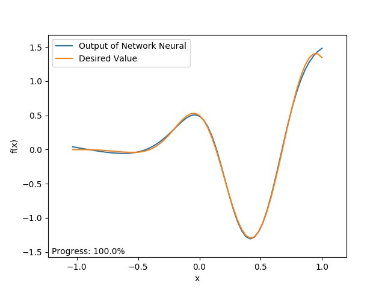
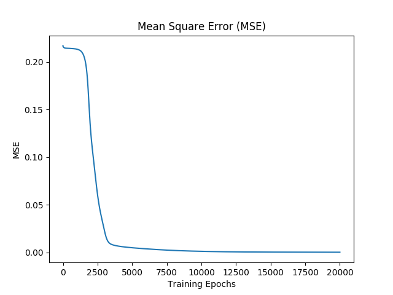

# Back-Propagation em Python

- O algoritmo do Backpropagation implementado na linguagem Python 2.7.

- O algoritmo foi desenvolvido para a aproximação de funções. Foram implementadas três métodos com três funções distintas: `load_first_function`, `load_second_function` e `load_third_function`.

