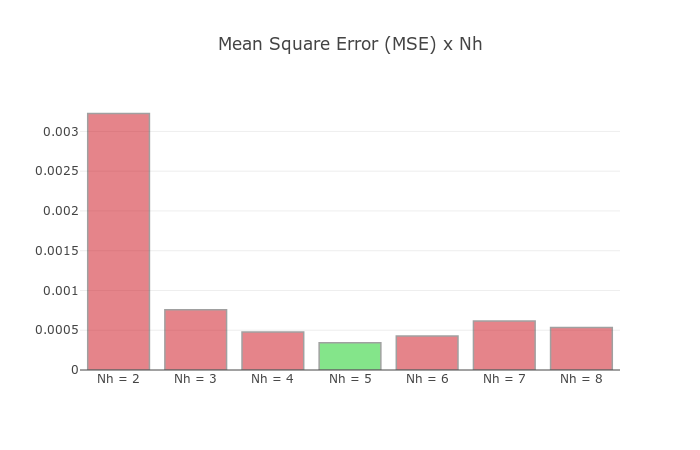

# Backpropagation em Python

- O algoritmo do Backpropagation implementado na linguagem Python 2.7.

- O algoritmo foi desenvolvido para a aproximação de funções. Foram implementadas três métodos com três funções distintas: `load_first_function`, `load_second_function` e `load_third_function`.

## Variação de Nh

Nh | MSE Final
:---: | :------:
1   | 0.114229517678
2   | 0.00322535095676
3   | 0.000758804236756
4   | 0.000479361961268
5   | 0.000342801720977
6   | 0.000428509742598
7   | 0.000616666676686
8   | 0.00053375090329

Na Figura abaixo temos o MSE em função do `Nh` (variando entre 2 e 8). Pelo gráfico fica nítido que, para essa função, o menor erro é obtido no caso em que `Nh = 5`.

## Variação da Taxa de Aprendizagem

